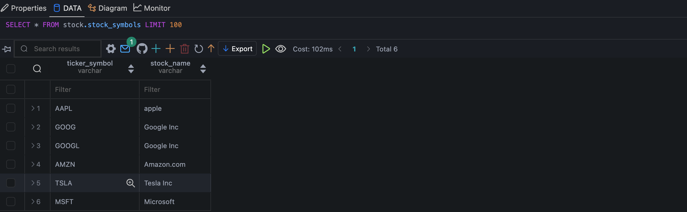
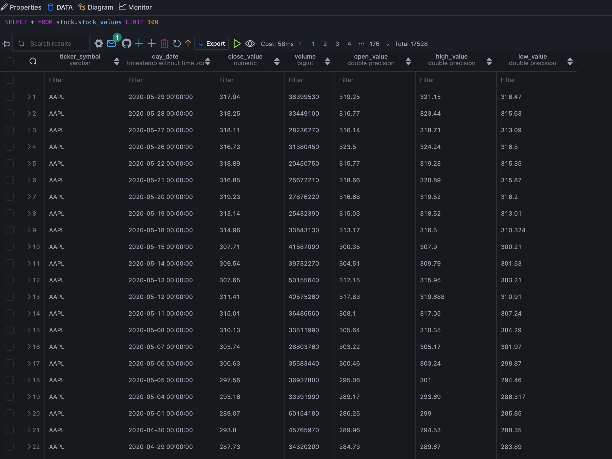

# Technical Tests for Apache Airflow ETL (MySQL to PostgreSQL)

## Prerequisites

* Python 
* pip
* docker
* docker compose
* VSCode

## Installation

```bash
python3 -m venv venv
source venv/bin/activate
pip3 install -r requirements.txt
git clone https://github.com/alfianhid/technical-tests.git
cd technical-tests
```

## Usage

1. Navigate to the `.env-example`, rename to `.env`, and edit it with your credentials.

2. Run the following commands to start DB and Airflow containers with the `.env` file:

```bash
docker compose --env-file <path_to_.env_file> -f <path_to_docker-compose-db.yml> up --build -d
```

```bash
docker compose --env-file <path_to_.env_file> -f <path_to_docker-compose-airflow.yml> up --build -d
```

4. Once all the services are up and running, go to [`https://localhost:8080`](https://localhost:8080) (use `airflow` for both username and password).

5. But we need to grant privileges to the MySQL database in order to write to it. Execute the following command:

```bash
docker exec -it <mysql_container_name> mysql -u root -p
grant ALL PRIVILEGES ON *.* TO 'your_username'
flush privileges;
exit
```

5. Before running the DAGs, we need to create schema and tables in the database. Execute the following command:

```bash
python3 dags/initialize_databases.py
python3 dags/initialize_reference_table.py
```

6. Now, go back to [`https://localhost:8080`](https://localhost:8080), then unpause all DAGs and run them for the first time.

## Results

This is the expected result for Airflow:


And this is the expected result (after DAG trigger) for local Postgres DB:


